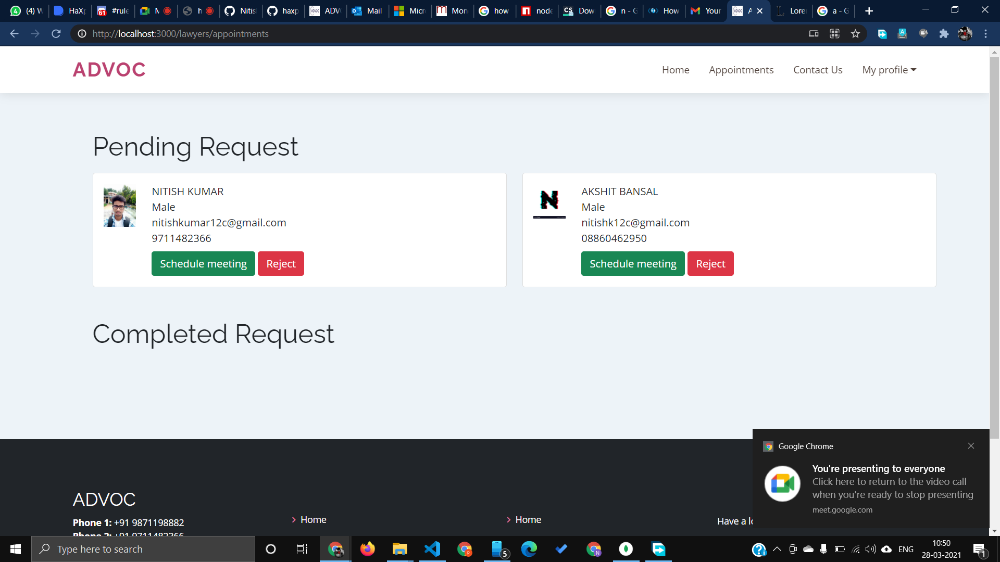
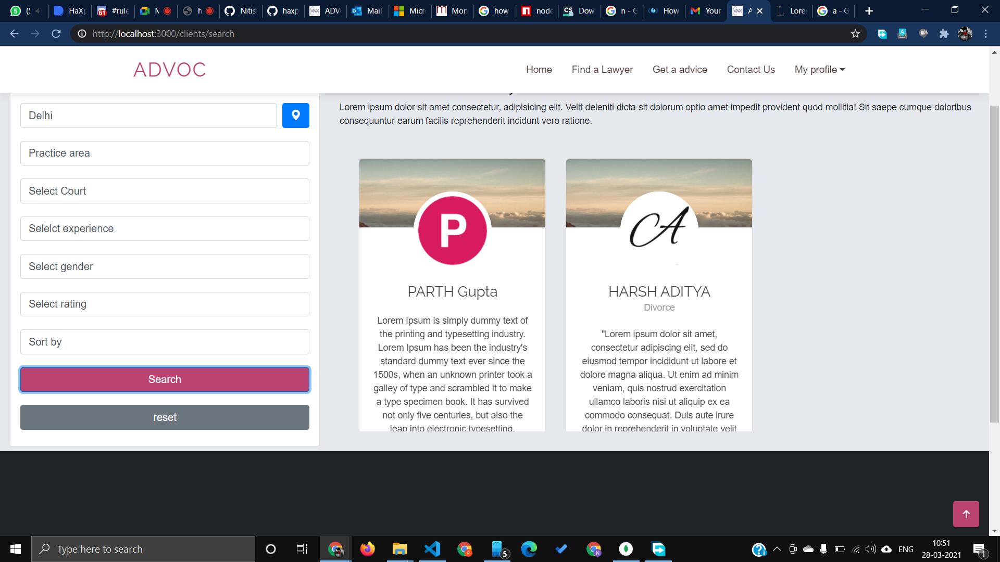
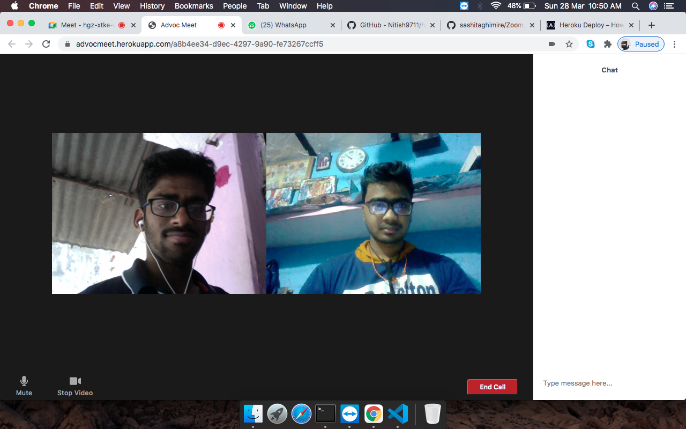

# HaXplore 2.0 - Submission Report Format

This is the official code repository for _XTERMINATE_ . This _type of application_ was developed during HaXplore 2.0, 
the online hackathon conducted by Codefest, the annual departmental fest of Computer Science department, IIT BHU Varanasi.

### _XTERMINATE_

* _[PARTH GUPTA](https://github.com/Parth-Gupta10)_
* _[NITISH KUMAR](https://github.com/Nitish9711)_
* _[AKSHIT BANSAL](https://github.com/abansal755)_
* _[ADITYA HARSH](https://github.com/adityaharsh2001)_

#### _ADVOC_

#### Overview

_ADVOC is a web application which is used to connect users to top rated lawyers according to their budget and needs which will also help lawyers get more clients. Our objectives for this project are -_

- _Design an effective system where we can connect with lawyers easily._
- _People who need legal advice can consult legal advisers online._
- _Increase the number of clients for independent lawyers._
- _Justice seekers who are in extreme need of top rated lawyers, can find them according to their budget._

#### Technology used

_The following technologies will be used to make this application -_
- _Express_
- _Multer_
- _Passport_
- _Mongoose_
- _MongoDB Atlas_
- _Razorpay API_
- _ AWS amazon lex bot_
- _ aws elastic beanstalk for hosting the application
- _ejs_
- _ipinfo api_
  

#### PPT LINK
https://drive.google.com/file/d/10uIRYKlqtOHgCgjRiJH5ZL68vEmbI8f_/view

#### demo video LINK
still working

#### WEBSITE LINK
1.  http://advoc-env.eba-rc3fxmmu.us-west-2.elasticbeanstalk.com/
2.  https://advoc-lawyers.herokuapp.com/

#### Screenshots/Demo Video

_Add some screens and a demo_

#### Usage
Follow these steps to run the application on your local machine - 
1. Clone this Repo to your Local Machine.
2. Open The Terminal/CMD in the folder haxplore-2.0-Xterminate.
3. Run command "npm i" which will install all the node modules required to run this project
4. Then run command "npm start" to start server
5. Open "localhost:3000" on your browser to use web application

#### AWS Services Used

_Write in brief about how you used AWS service to improve your application._
1. AWS Elastic Beanstalk
    We have used elastic beanstalk to host our node server as it easy-to-use service for deploying and scaling web applications and services.You can simply upload your code and Elastic Beanstalk automatically handles the deployment, from capacity provisioning, load balancing, auto-scaling to application health monitoring. At the same time, you retain full control over the AWS resources powering your application and can access the underlying resources at any time.

2. AWS amazon lex
   we have used this service for building our website chat bot. we impleted our bot with with lamda function.

